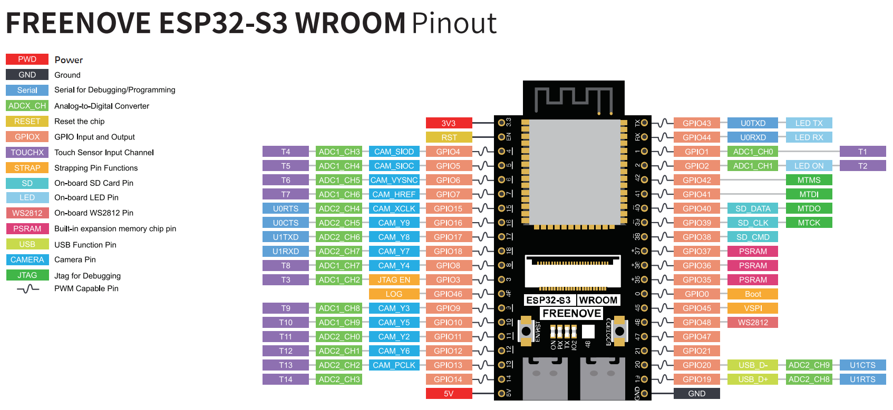

# hardwareProjects

Freenove ESP32S3 CAM pinout
 
</img>

Overall goal: develop a ESP32 based people counter with PIR, cameras and thermal cameras

To Dos

- [ ] Figure out differences between ESP32 boards (dev, S3dev etc.) in terms of ports, PSRAM, accesories
- [ ] Figure out power options (e.g. batter, wall wart)
- [x] regular camera  (e.g.esp32Cam)
- [x] regular camera + S3+saving images to disk (e.g. TimeLapseDiskS3)
- [x] thermal camera + display using Processing(e.g. esp32S3ThermalCamera)
- [ ] time stamp data logging
- [ ] thermal camera + saving images to disk
- [ ] PIR + s3
- [ ] PIR + saving to disk
- [ ] AI with thermal images
- [ ] AI with PIR data
- [ ] AI with photos
- [ ] webserver with esp32 (without other wifi)
- [ ] Peer to peer wifi with esp32
- [ ] Peer to peer wifi with esp32 with external antenna
- [ ] jetson setup
- [ ] jetson as server
- [ ] design backend system with db + time stamps
- [ ] dashboard
- [ ] print case

