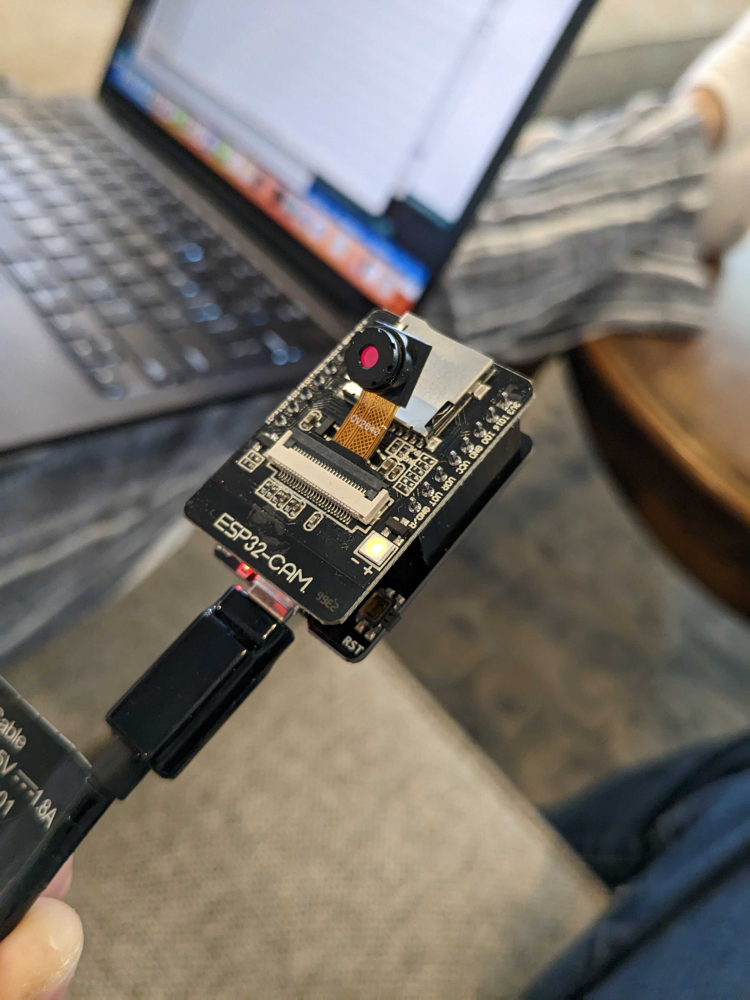

# ESP32 cam  

Simple example to take a picture using an ESP32 cam like the one below.

Also stores image on microSD card

boilerplate from https://randomnerdtutorials.com/esp32-cam-take-photo-save-microsd-card/

</img>
